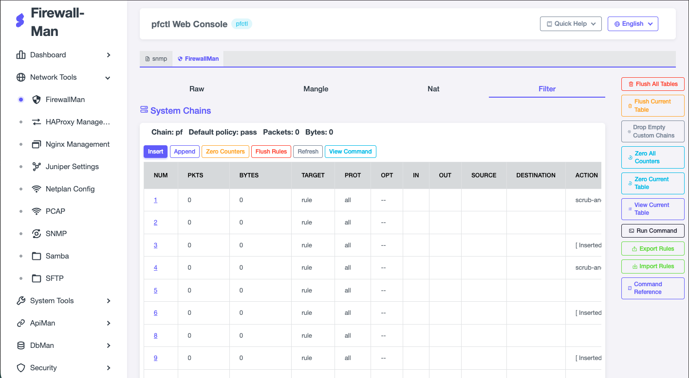

# Miitai 網路與安全工具管理平臺

[](https://opensource.org/licenses/Apache-2.0)

基於 Rust 實作的防火牆 Web 管理工具，支援 **Linux (iptables)**、**macOS (pfctl)** 與 **Windows (PowerShell NetSecurity)** 三平台。

<br/>
<p align="center"></p>
<br/>

## 功能特色

- **跨平台支援**：Linux 使用 iptables / ip6tables，macOS 使用 pfctl，Windows 使用 PowerShell NetSecurity，啟動時自動偵測
- **IPv4 / IPv6 雙協定**：同時管理 IPv4 與 IPv6 防火牆規則（僅 Linux）
- **平台感知 UI**：前端自動偵測平台，動態切換命令名稱與操作提示
- **Web 圖形化管理**：Sneat Bootstrap 5 響應式介面，直覺的表格化規則瀏覽與操作
- **規則管理**：檢視、新增、插入、刪除、清空規則
- **計數器管理**：清零規則或整表統計數據（僅 iptables）
- **匯入 / 匯出**：批次匯入規則
- **自訂命令**：直接執行任意防火牆命令
- **Shell 終端機**：左側選單內建 xterm.js 終端機，後端原生 PTY 串接本機 shell
- **AI 助手**：整合 opencode CLI，輸入自然語言自動產生對應的防火牆命令（含程式碼區塊的複製/執行按鈕）
- **安全認證**：HTTP Basic Auth，參數防注入過濾
- **多語介面**：繁體中文 / English / 日本語 即時切換（下拉選單）

## 快速開始

### Linux / macOS

```bash
# 建置
cd backend && cargo build --release

# 執行（需 root / sudo 權限）
sudo ./firewall-man

# 自訂監聽位址與認證
./firewall-man -a :8080 -u myuser -p mypass

# 使用環境變數
export IPT_WEB_USERNAME=admin
export IPT_WEB_PASSWORD=secret
export IPT_WEB_ADDRESS=:10001
./firewall-man
```

### Windows

```powershell
# 建置
cd backend && cargo build --release

# 執行（需以系統管理員執行）
.\firewall-man.exe
```

啟動後開啟瀏覽器訪問 `http://<主機IP>:10001`。

## 平台差異

| 功能 | Linux (iptables) | macOS (pfctl) | Windows (PowerShell) |
|------|------------------|---------------|----------------------|
| 規則列表 | 完整 Chain/Table 結構 | 簡化列表顯示 | 所有規則列表 |
| 新增/插入規則 | 支援 | 支援（透過 exec） | 支援（透過 `New-NetFirewallRule`） |
| 刪除規則 (by id) | 支援 | 不支援 | 支援（`Remove-NetFirewallRule`） |
| 清空規則 | 支援（按 table/chain） | 不支援單一清空 | 不支援批次清空 |
| 計數器清零 | 支援 | 不支援 | 不支援 |
| 自定義空鏈清理 | 支援 | 不支援 | 不支援 |
| 匯入/匯出 | iptables-save 格式 | pfctl -s all 格式 | PowerShell 命令稿格式 |
| 自訂命令 | iptables 命令 | pfctl 命令 | PowerShell 命令 |

## Docker

```bash
docker build -t Miitai/firewall-man:0.1.0 .
docker run -d --network host --privileged Miitai/firewall-man:0.1.0
```

> 注意：需使用 `--privileged` 或以 `CAP_NET_ADMIN` 執行，否則防火牆命令將被拒絕。

## API 端點

| 方法 | 路徑 | 說明 |
|------|------|------|
| POST | `/version` | 取得防火牆版本 |
| POST | `/listRule` | 列出規則（參數：table, chain, protocol） |
| POST | `/listExec` | 列出原始命令（參數：table, chain） |
| POST | `/flushRule` | 清空規則（參數：table, chain，非 Linux 不支援） |
| POST | `/deleteRule` | 刪除特定規則（參數：table, chain, id，macOS 不支援） |
| POST | `/flushMetrics` | 清零計數器（參數：table, chain, id，僅 Linux） |
| POST | `/getRuleInfo` | 取得單條規則資訊（參數：table, chain, id） |
| POST | `/flushEmptyCustomChain` | 清空自定義空鏈（僅 Linux） |
| POST | `/export` | 匯出規則 |
| POST | `/import` | 匯入規則（參數：rule） |
| POST | `/exec` | 執行自訂防火牆命令（參數：args） |
| GET | `/` | 管理介面首頁 |
| GET | `/platform` | 取得目前平台（linux / macos / windows） |
| GET | `/web/*path` | 靜態資源（Sneat Bootstrap 5 CSS/JS/字型） |
| GET | `/docs/iptables-command-reference` | iptables 命令參考文件 |
| GET | `/shell` | WebSocket：嵌入式 shell 終端機（PTY） |
| GET | `/ai` | WebSocket：AI 助手（呼叫本機 opencode CLI） |
| POST | `/log` | 接收前端 logger 訊息並輸出到伺服器終端機 |

## 環境變數

| 變數 | 說明 | 預設值 |
|------|------|--------|
| `IPT_WEB_USERNAME` | 登入使用者名稱 | `admin` |
| `IPT_WEB_PASSWORD` | 登入密碼 | `admin` |
| `IPT_WEB_ADDRESS` | 監聽位址 | `:10001` |

## 命令列參數

| 參數 | 說明 | 預設值 |
|------|------|--------|
| `-u` / `--username` | 登入使用者名稱 | `admin` |
| `-p` / `--password` | 登入密碼 | `admin` |
| `-a` / `--address` | 監聽位址 | `:10001` |

## Shell 終端機

左側選單點選 **Shell** 會在主畫面開啟嵌入式終端機（xterm.js），透過 WebSocket 與後端的本地 shell 連線。

後端實作為**原生 PTY**（不是 `script` 包裝）：
- 使用 `nix::pty::posix_openpt` 開啟 PTY master，`grantpt`/`unlockpt`/`ptsname` 設定 slave
- `fork()` 後在子行程內 `setsid()` 設為 session leader，把 slave `dup2` 到 fd 0/1/2，再以 `ioctl(TIOCSCTTY)` 設為 controlling tty，最後 `execvp` 啟動 shell
- 父行程持有 master fd，與 WebSocket 雙向串流
- macOS 啟動 `/bin/zsh -i`，Linux 啟動 `/bin/bash -i`，Windows 啟動 `powershell.exe`
- 自動啟用 `ECHO`/`ICANON` 終端旗標，所以輸入會即時回顯且支援行編輯
- 支援視窗 resize（前端 xterm.js FitAddon 觸發 → 後端 `ioctl(TIOCSWINSZ)`）

所有輸入/輸出皆會鏡像到：
1. 頁面底部 Logger 面板
2. 瀏覽器 DevTools Console
3. 伺服器終端機（`target: "frontend"`）

### macOS 修正 zsh compinit 警告

在 macOS 點選 Shell 時，若出現以下警告：

```
zsh compinit: insecure directories and files, run compaudit for list.
Ignore insecure directories and files and continue [y] or abort compinit [n]?
```

這是 zsh 為 Homebrew 安裝的 completion 檔案做權限檢查時，因目錄/檔案被群組或其他使用者寫入而觸發。**已在後端透過 `setenv("ZSH_DISABLE_COMPFIX", "true")` 略過此檢查**（僅影響本工具啟動的 zsh），多數情況下不需額外處理。

若仍想徹底修正，可手動修復權限：

```bash
# 檢查哪些檔案有問題
compaudit

# 典型修法（依 compaudit 輸出調整路徑）
chmod -R go-w /usr/local/share/zsh /usr/local/share/zsh/site-functions
chmod -R go-w ~/.zshrc ~/.zcompdump*
```

> 注意：`ZSH_DISABLE_COMPFIX` 只略過 compinit 的警告檢查，並不會關閉 completion 本身的功能。

## AI 助手 (opencode)

左側選單點選 **AI 助手** 開啟聊天式介面，可輸入自然語言需求（例如「封鎖所有來自 192.168.1.0/24 的流量」），後端會呼叫本機的 `opencode` CLI 產生對應的防火牆命令。

### 運作流程

1. 前端透過 WebSocket `/ai` 把 prompt 送給後端
2. 後端 spawn `opencode run "<prompt>"` 子行程，串流其 stdout/stderr
3. 前端收到串流內容，透過 `marked.js` 轉成 Markdown 顯示
4. 程式碼區塊（` ``` ` 區塊）會自動加上 **複製** 與 **執行** 按鈕：
   - **複製**：把命令複製到剪貼簿
   - **執行**：呼叫現有的 `/exec` 端點直接執行（會彈出確認）

### 前置需求

- 本機已安裝 [opencode](https://github.com/sst/opencode) CLI（`opencode` 在 `$PATH` 內可執行）
- 首次使用前需先在 opencode 內登入/設定 provider（`opencode auth`）

### 狀態指示

視圖右上角有狀態徽章：
- 灰色 **閒置**：WebSocket 未連線
- 藍色 **執行中**：opencode 正在生成
- 綠色 **完成**：本次請求結束
- 紅色 **錯誤**：spawn 失敗或連線中斷

## 從 Go 版遷移

本專案為 [iptables-web](https://github.com/pretty66/iptables-web) 的 Rust 移植版本。詳見 `AGENTS.md` 中的對應說明。

## 使用者介面
  參照自 https://github.com/themeselection/sneat-bootstrap-html-admin-template-free
 

## 授權

Apache License 2.0


## example
https://caloskao.org/linux-iptables-ipport-forwarding/
iptables -t nat -A PREROUTING -p tcp --dport 20022 -j DNAT --to 192.168.0.1:22
iptables -t nat -A POSTROUTING -p tcp --dport 22 --dst 192.168.0.1 -j MASQUERADE

